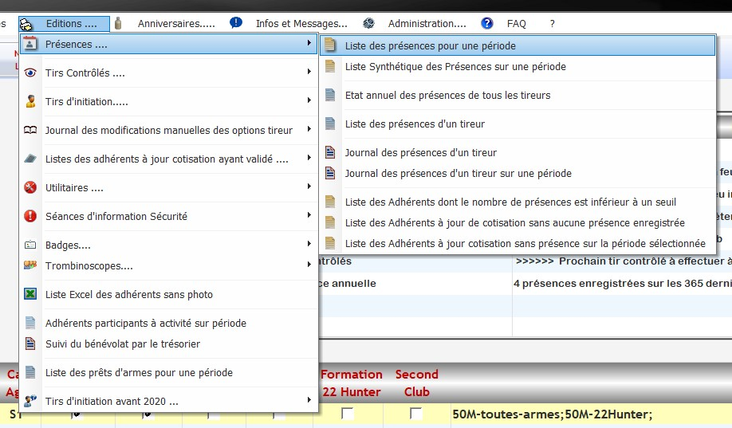
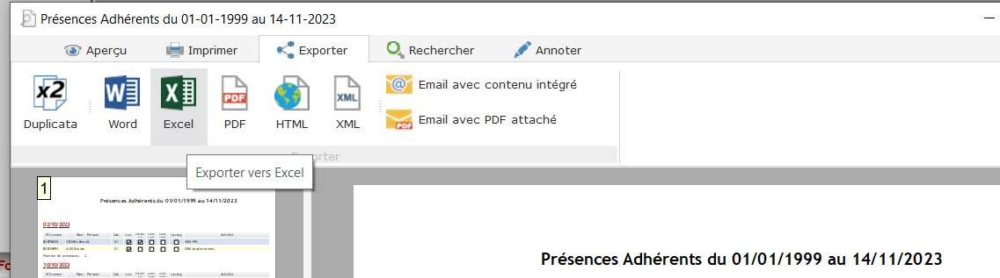

<script setup>
import RoleLevelComponent from '../../../components/RoleLevelComponent.vue'
</script>

# Import des données Cerbère <RoleLevelComponent level="admin" />

## Import des présences <RoleLevelComponent level="admin" />

**Cette commande ne créé aucun utilisateur**.

Il est fortement conseillé de faire un [Import des utilisateurs](itac) avant.   
Sans cela certaines présences pourrait ne pas être importé.

### Exporter les données depuis Cerbère
Les données de présence dans Cerbère pouvant être nombreuses, sont export peut prendre beaucoup de temps.

1. Se connecter en tant qu'Administrateur.
    - Par défaut le nom d'utilisateur est `Admin` et le mot de passe est `Admin`
2. Cliquer sur `Editions ...` > `Présences ...` > `Liste des présences pour une période`   
   
3. Définir la période
   1. Pour la date début mettre `01/01/1999` par exemple
   2. Pour la date de fin mettre le jour actuel ou le lendemain   
      
4. Une fois l'export fini, un message d'erreur apparait indiquant qu'il n'y a pas de données à imprimer.  
  Il s'agit d'un bug dans Cerbère. En cliquant sur Ok, l'aperçu devrait se mettre à jour avec les données dedans.  
     
 
::: danger
   Bien attendre que la liste a fini de se remplir (peut prendre quelques dizaine de minutes)
:::

5. Se rendre dans l'onglet `Exporter` et cliquer sur `Excel`  
    
  L'export peut aussi prendre une 10ène de minutes.
 
### Exécution de la commande d'import
L'import se fait via la commande suivante :

```shell
bin/console import:cerbere:presence <file>
```

Paramètres requis:
- `file`: chemins vers le fichier depuis la ligne de commande

L'import va automatiquement créer les activités (10M, 25M par exemple) et lier **seulement** avec les utilisateurs présents en base de données.

### Import en ligne

Explication pour l'import disponible dans [la documentation du frontend](/frontend/docs/import/cerbère#import-depuis-le-site)
