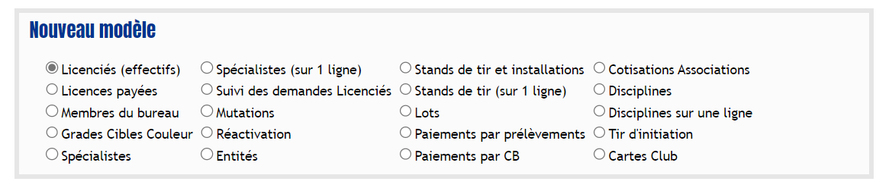
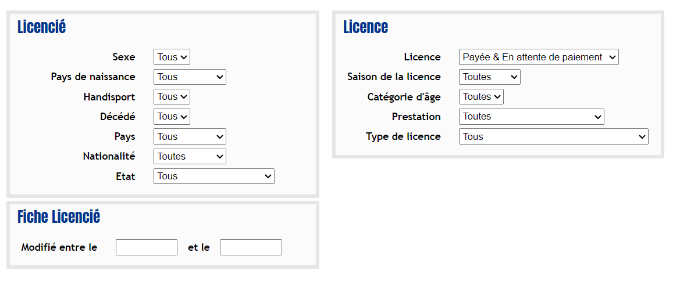
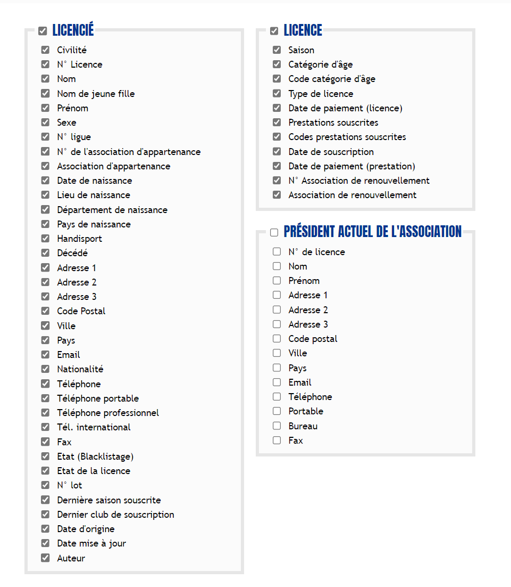
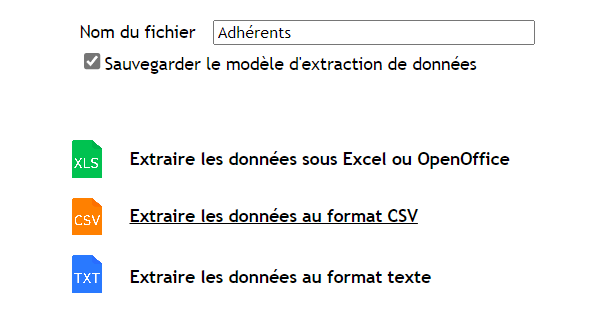
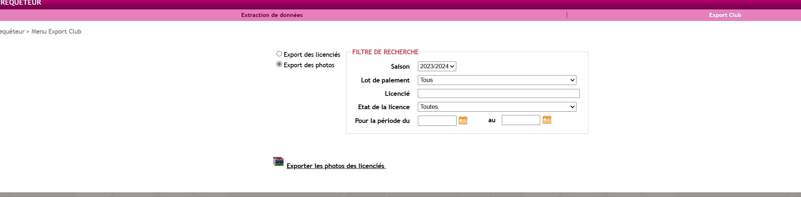

<script setup>
import RoleLevelComponent from '../../../components/RoleLevelComponent.vue'
</script>

# Import des données <RoleLevelComponent level="admin" />

## Import des membres
L'import se fait depuis un CSV généré depuis le site itac

- [Export depuis itac](#export-depuis-itac)
- [Import en ligne de commande](#import-en-ligne-de-commande)

### Export depuis itac
1. Se rendre sur le **Requêteur** : https://itac.pro/Requeteur/Requeteur.aspx
2. Utiliser le modèle `Adhérents` et cliquer sur CSV
3. Si le modèle n'existe pas : 
   1. Créer un nouveau modèle `Licenciés (effectifs)`  
      
   2. Mettre tous les champs sur `Tous`
      
   3. Tout cocher dans `Licencié` et `Licence`
      
   4. Nommer le fichier `Adhérents`
   5. Cliquer sur `Sauvegarder le modèle d'extraction de données`
   6. Cliquer sur `Extraire les données au format CSV` 
      L'export se télécharge automatiquement et peut prendre un peu de temps.
      


### Import en ligne de commande
L'import se fait via la commande suivante :

```shell
bin/console import:itac <file>
```

Paramètres requis:
- `file`: chemins vers le fichier depuis la ligne de commande

L'import va automatiquement créer/mettre à jour les membres.

## Import des photos
L'import se fait via l'archive généré depuis le site itac

- [Export depuis itac](#export-depuis-itac-1)
- [Import](#import-en-ligne-de-commande-1)
### Export depuis itac

1. Se rendre à l'adresse suivante https://itac.pro/Requeteur/ExportClub.aspx
2. Sélectionner `Export des photos`   
   
3. Télécharger le fichier zip fourni par itac sur le site

### Import en ligne de commande
L'import se fait seulement depuis la version en ligne

Explication pour l'import disponible dans [la documentation du frontend](/frontend/docs/import/itac#import-depuis-le-site)
