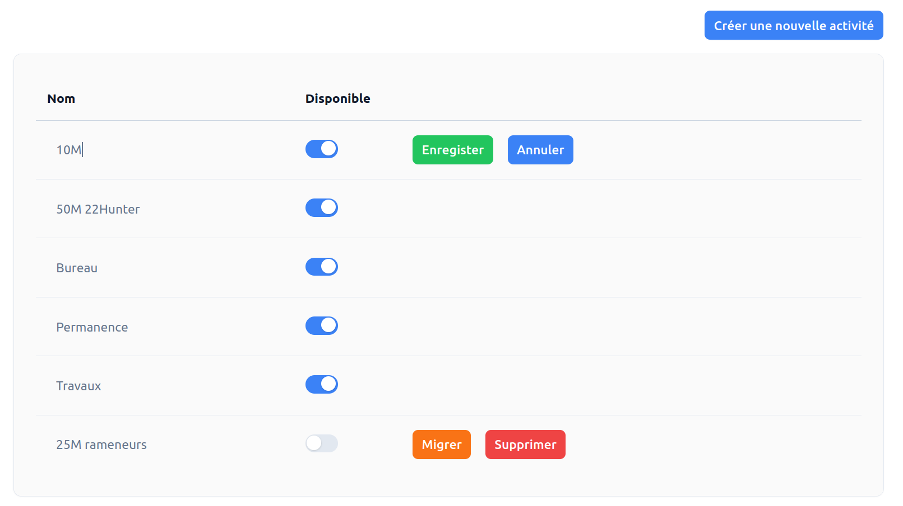

# Gestion des activités <RoleLevelComponent level="admin" />

Actions possibles :
- Changement du nom
  - Clic sur le text
- Désactivation d'une activité
- Migration d'une activité (possible seulement si l'activité est désactivée)
- Suppression d'une activité (possible seulement si l'activité est désactivée)

