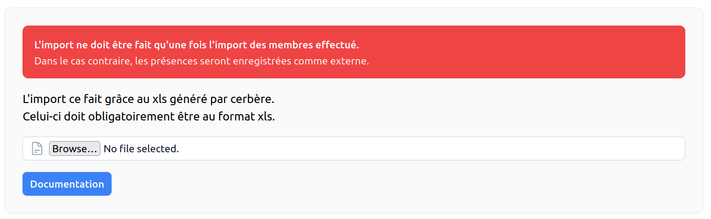

# Import des données Cerbère <RoleLevelComponent level="admin" />

## Import des présences
**L'import ne créé aucun utilisateur**.

Il est fortement conseillé de faire un [Import des utilisateurs](itac) avant.   
Sans cela certaines présences pourrait ne pas être importé.

### Exporter les données depuis Cerbère
Explication pour l'export disponible dans [la documentation du backend](/backend/docs/import/cerbère#export-depuis-itac)

### Import depuis le site <RoleLevelComponent level="admin" />

Avant d'effectuer l'import, il est fortement recommander d'effecteur un [import des membres](itac.md#import-des-membres).

L'import est disponible à l'adresse suivante : `<site>/admin/imports/cerbere`

