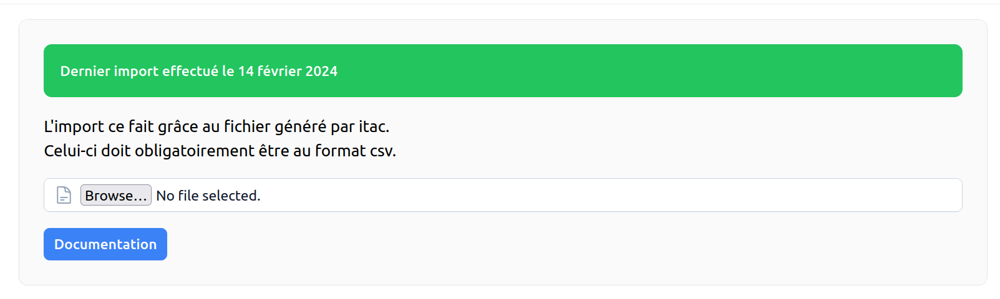

# Import des données <RoleLevelComponent level="admin" />

## Import des membres
L'import se fait depuis un CSV généré depuis le site itac

- [Export depuis itac](#export-depuis-itac)
- [Import depuis le site](#import-depuis-le-site)

### Export depuis itac
Explication pour l'export disponible dans [la documentation du backend](/backend/docs/import/itac#export-depuis-itac)

### Import depuis le site <RoleLevelComponent level="admin" />
La page est accessible depuis le menu d'administration.

Le fichier envoyé doit obligatoirement être au format CSV.

## Import des photos

### Export depuis itac
Explication pour l'export disponible dans [la documentation du backend](/backend/docs/import/itac#export-depuis-itac-1)

### Import depuis le site <RoleLevelComponent level="admin" />
La page est accessible depuis le menu d'administration.

Le fichier envoyé doit obligatoirement être l'archive généré depuis itac.
