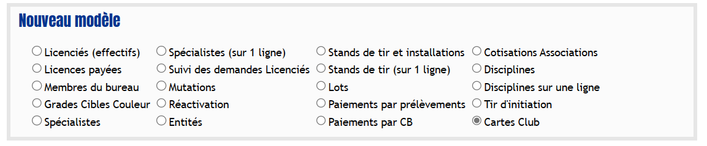
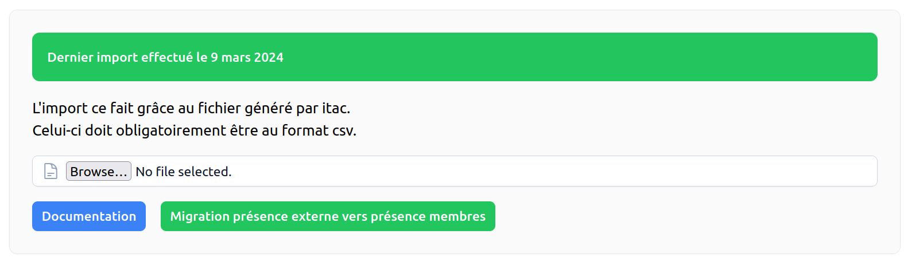

# Import des données <RoleLevelComponent level="admin" />

## Import des membres
L'import se fait depuis un CSV généré depuis le site itac

- [Export depuis itac](#export-depuis-itac)
- [Import depuis le site](#import-depuis-le-site)

### Export depuis itac
1. Se rendre sur le **Requêteur** : https://itac.pro/Requeteur/Requeteur.aspx
2. Utiliser le modèle `Adhérents` et cliquer sur CSV
3. Si le modèle n'existe pas :
    1. Créer un nouveau modèle `Licenciés (effectifs)`  
       
    2. Mettre tous les champs sur `Tous`
       
    3. Tout cocher dans `Licencié` et `Licence`
       
    4. Nommer le fichier `Adhérents`
    5. Cliquer sur `Sauvegarder le modèle d'extraction de données`
    6. Cliquer sur `Extraire les données au format CSV`
       L'export se télécharge automatiquement et peut prendre un peu de temps.
       

### Import depuis le site <RoleLevelComponent level="admin" />
La page est accessible depuis le menu d'administration.

Le fichier envoyé doit obligatoirement être au format CSV.

## Import des membres club secondaire
L'import se fait depuis un CSV généré depuis le site itac

- [Export depuis itac](#export-depuis-itac-1)
- [Import depuis le site](#import-depuis-le-site-1)

### Export depuis itac
1. Se rendre sur le **Requêteur** : https://itac.pro/Requeteur/Requeteur.aspx
2. Utiliser le modèle `Adh-2nd-club` et cliquer sur CSV
3. Si le modèle n'existe pas :
    1. Créer un nouveau modèle `Cartes Club`  
       
    2. Sélectionner toutes les saisons  
       
    3. Cocher tout les champs  
       
    4. Nommer le fichier `Adh-2nd-club`
    5. Cliquer sur `Sauvegarder le modèle d'extraction de données`
    6. Cliquer sur `Extraire les données au format CSV`
       L'export se télécharge automatiquement et peut prendre un peu de temps.
       

### Import depuis le site <RoleLevelComponent level="admin" />
La page est accessible depuis le menu d'administration.

Le fichier envoyé doit obligatoirement être au format CSV.

Une fois l'import effectué, une migration des présences externes vers présence membres est automatiquement effectuée.

## Import des photos

### Export depuis itac
1. Se rendre à l'adresse suivante https://itac.pro/Requeteur/ExportClub.aspx
2. Sélectionner `Export des photos`   
   
3. Télécharger le fichier zip fourni par itac sur le site

### Import depuis le site <RoleLevelComponent level="admin" />
La page est accessible depuis le menu d'administration.

Le fichier envoyé doit obligatoirement être l'archive généré depuis itac.
