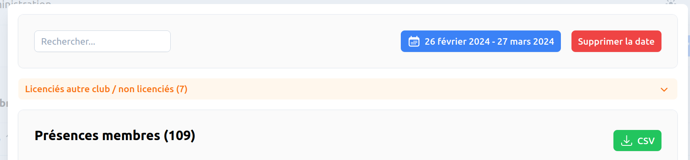

<script setup>
import RoleLevelComponent from '../../../components/RoleLevelComponent.vue'
</script>

# Import des présences <RoleLevelComponent level="admin" />

L'import se fait depuis un CSV généré depuis le site itac

- [Export](#export)
- [Import](#import)

## Export <RoleLevelComponent level="admin" />
L'export en csv est possible depuis plusieurs endroits :

- Historique de présence
   - Une date doit être impérativement définie.
- Profil d'un membre



## Import <RoleLevelComponent level="admin" />
L'import se fait depuis l'interface d'administration.

Avant d'effectuer l'import, les **activitiés doivent être présentes**.  
Dans le cas contraire, elles ne seront pas créées.

Le fichier doit être au format CSV.

Voici un exemple de CSV valide

```csv
member.licence,date,activities.0.name,activities.1.name
01234578,2018-08-03T00:00:00+00:00,50M - Toutes armes,Non existant
45678412,2018-08-03T00:00:00+00:00,25M,
45678412,2018-08-04T00:00:00+00:00,50M - Toutes armes,
45671134,2018-08-03T00:00:00+00:00,Bureau,
```
