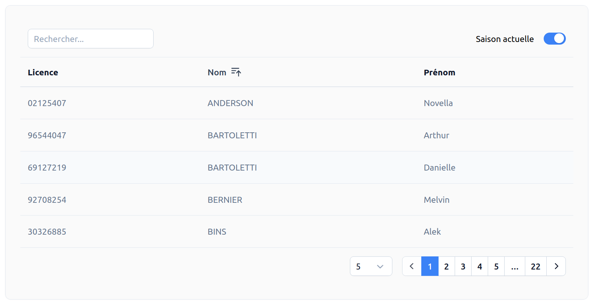

# Gestion membre <RoleLevelComponent level="supervisor" />

## Liste <RoleLevelComponent level="supervisor" />
La liste affiche par défaut les membres de la saison actuelle.

La recherche est appliquée sur :

- Numéro de licence
- Nom
- Prénom

En cliquant sur une ligne, une fiche détaillée est retournée.

## Informations détaillées <RoleLevelComponent level="supervisor" />

Actions possibles :

- Changement du mot de passe <RoleLevelComponent level="admin" />
- Modification du rôle <RoleLevelComponent level="admin" />
- Activation/Désactivation du compte <RoleLevelComponent level="admin" />
- Affichage des statistiques de présences <RoleLevelComponent level="supervisor" />
  - 12 dernièrs mois
  - Possibilité de supprimer une présence <RoleLevelComponent level="admin" />

