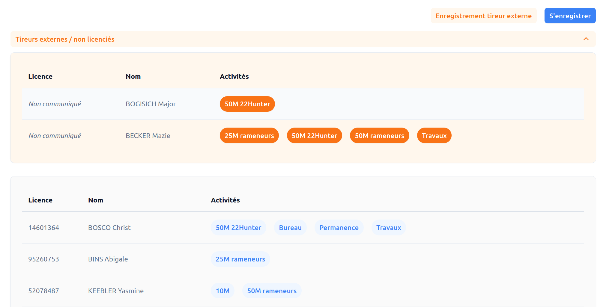
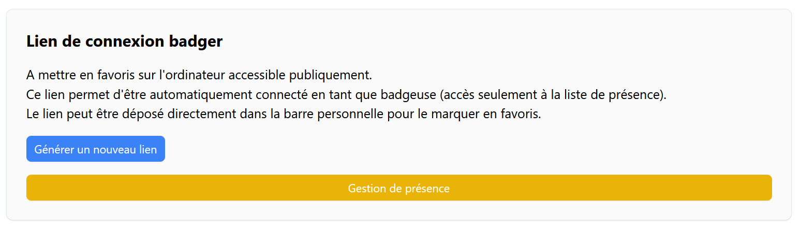

# Gestion des présences <RoleLevelComponent level="badger" />

- Présences externes (section orange)
- Présences des membres du club
  - Affichage en rouge si la dernière activité contrôlé date de plus de 12 mois.
  - Affichage en jaune lorsque le certificat médical arrive à expiration (2 mois avant l'expiration).
  - Affichage en rouge lorsque le certificat médical est expiré.

## Connexion en mode badgeuse/pointeuse
Afin de simplifier la gestion des mots de passe, il existe un compte spécifique pour l'ordinatateur/tablette accessible à tout le monde et qui sert au pointage (appelé ici badgeuse).

Il s'agit d'une connexion sans mot de passe.

Pour ajouter cette connexion rapide, il faut:

1. Se connecter en mode admin depuis l'ordinateur qui servira de pointeuse.
2. Se rendre dans `Administration > Configuration globale`
3. Glisser et déposer dans la barre d'adresse du navigateur le bouton jaune `Gestion de présence`   
   Ou cliquer sur le boutton et lien sera copié dans votre presse-papier.
4. Se déconnecter
5. Et voila, en cliquant maintenant dans le nouveau favoris, la connexion sera automatiquement faite sur le compte `badger`

::: danger Attention
L'action `Générer un nouveau lien` invalidera le lien précédemment généré.
:::
