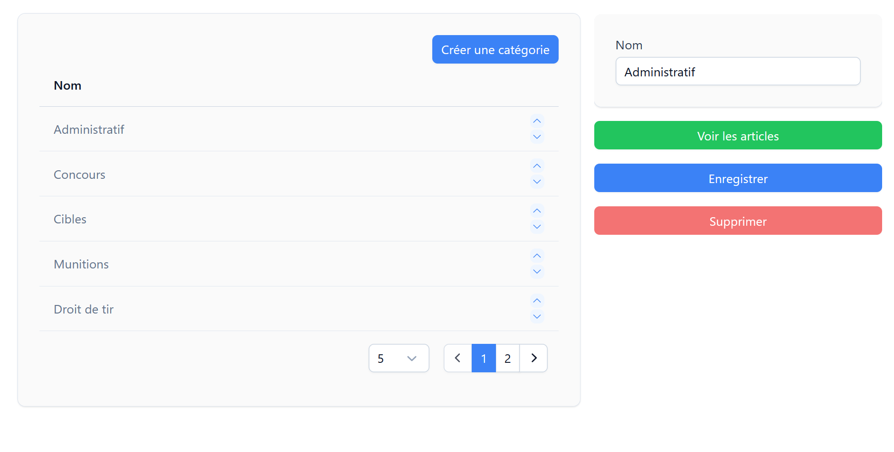
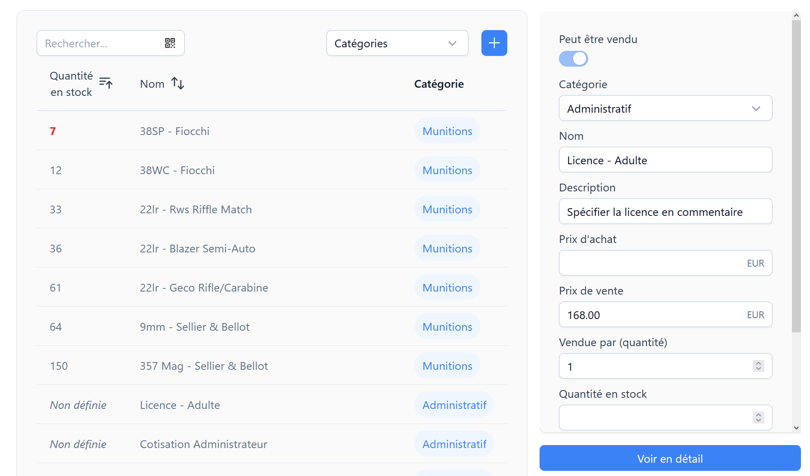
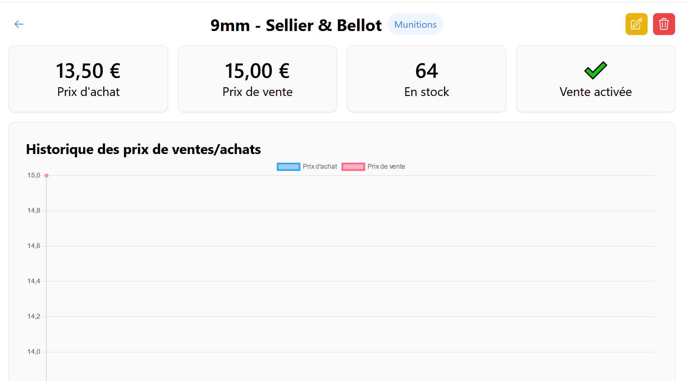

# Gestion de l'inventaire <RoleLevelComponent level="admin" />

La configuration de l'inventaire est faite sur 2 pages

- Catégories
  - Création
  - Changement de l'ordre (pour mettre en avant les licences lors de la période de renouvellement)
- Inventaire (création d'article)

## Catégories <RoleLevelComponent level="admin" />

::: warning Suppression
La suppression d'une catégorie n'est possible que si et seulement si celle-ci ne dispose d'aucun article.
:::

Le changement d'ordre d'une catégorie s'effectue en cliquant sur les fléches bleue située à droite dans le tableau.

## Inventaire <RoleLevelComponent level="admin" />

### Listing

Le tableau affiche tous les articles correspondants aux filtres appliqués (recherche et/ou catégories spécifiées).

Lors de la sélection d'un article sur le côté droite de la page apparait un récapitulatif de celui-ci ainsi que d'un bouton redirigeant sur la [fiche complète.](#page-article)

Lorsque le stock du produit atteint le seuil d'alerte défini celui-ci est affiché en rouge dans la liste.

### Page article

Cette page permet d'avoir une vue détaillée pour un produit.

Il est possible de voir rapidement si la vente de celui-ci est activé ainsi que le nombre en stock.

L'édition ou la suppression est possible en cliquant sur les boutons situés en haut à droite de la page.

Un tableau affichant les précédents prix d'achats et de ventes est aussi généré.
