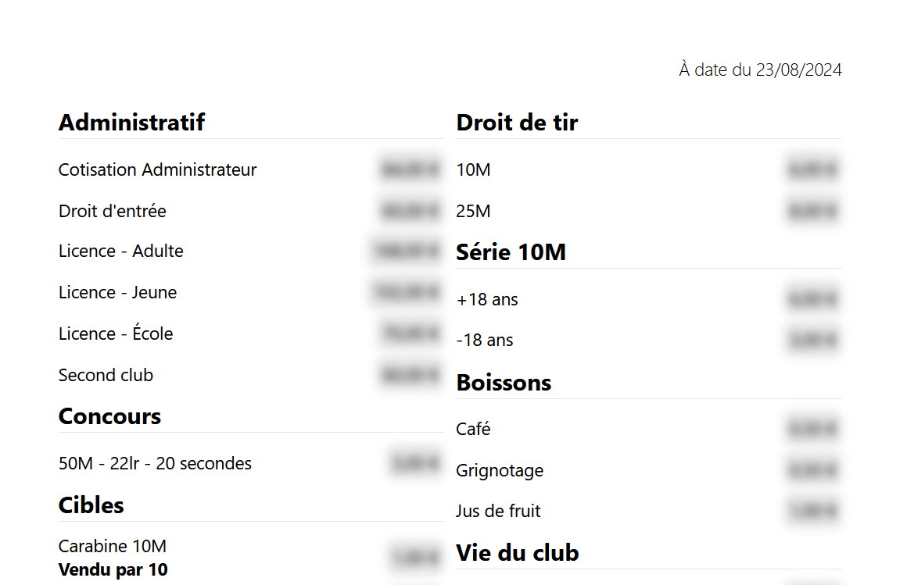
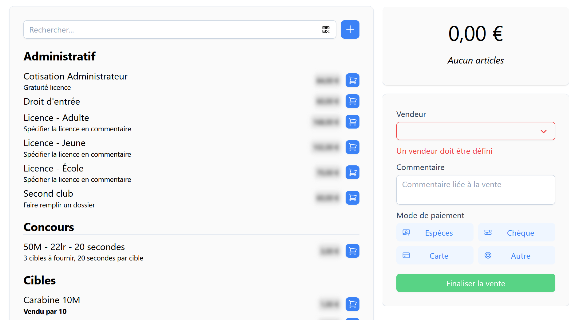
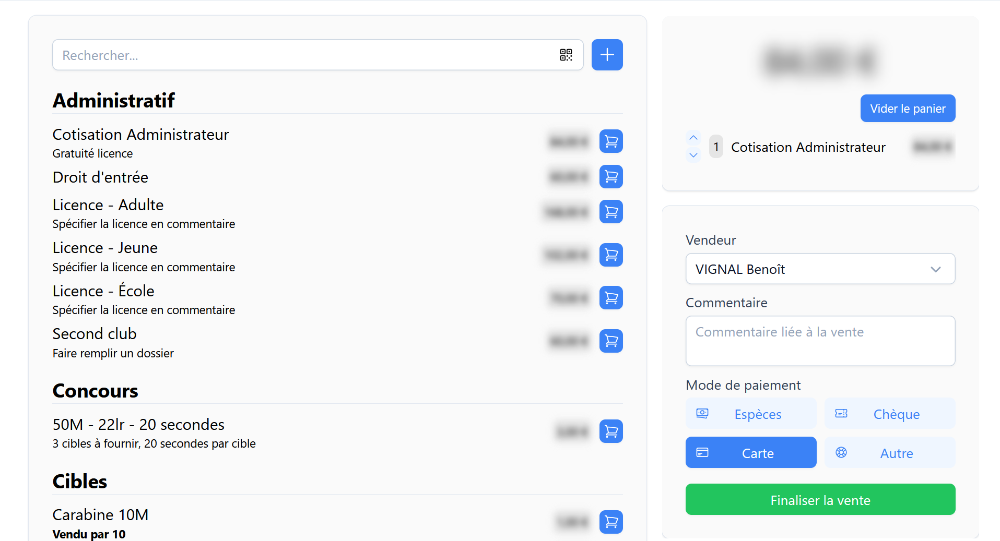
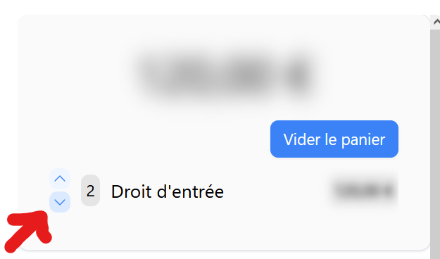
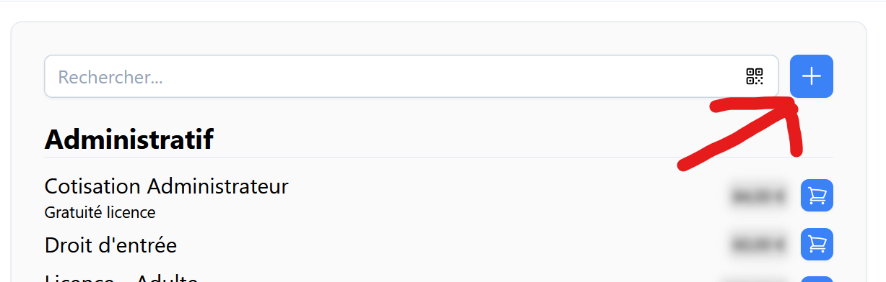
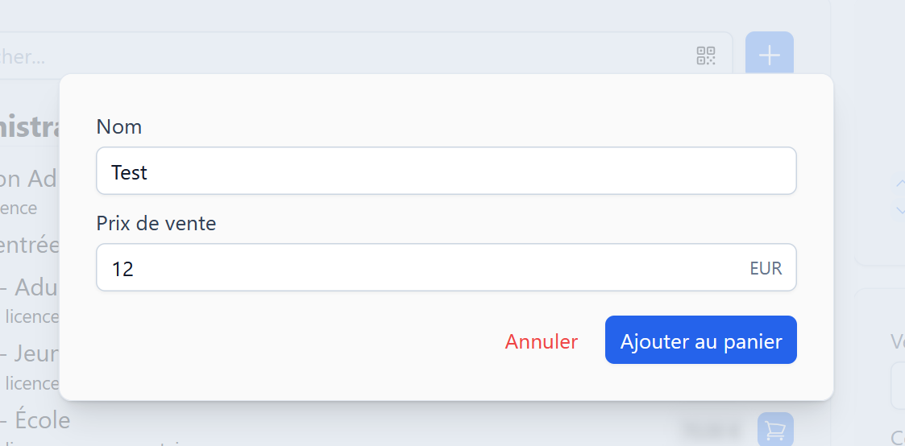
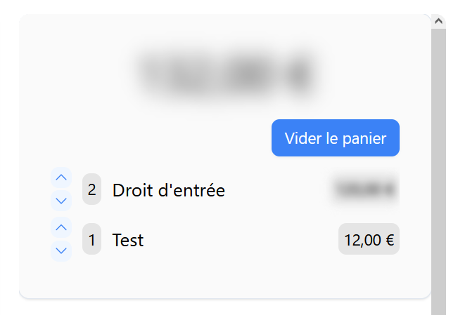
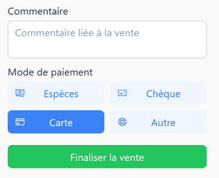
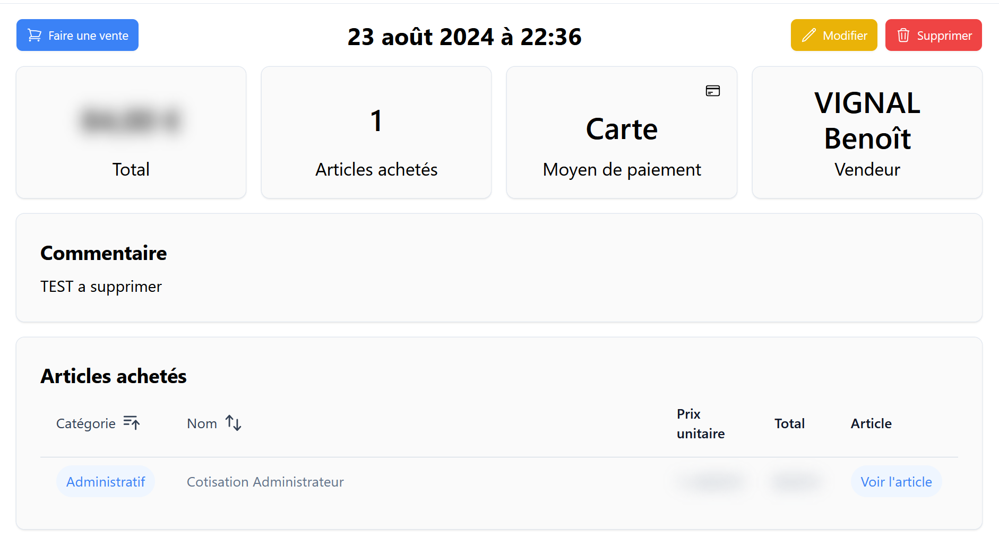

# Ventes <RoleLevelComponent level="supervisor" />

## Imprimer la liste des prix <RoleLevelComponent level="supervisor" />
Pour imprimer la liste de prix à jour, il suffit de faire "Imprimer la page" depuis votre navigateur.

Une liste sur 2 colonnes sera générée.

## Faire une vente <RoleLevelComponent level="supervisor" />

::: danger Attention
Afin de pouvoir effectuer une vente un vendeur doit être sélectionné.
:::

### Sélection d'un vendeur
La liste affiche toutes les personnes ayant le rôle permanent ou administrateur.

### Article présent dans la liste
Pour ajouter le produit au panier, il suffit de cliquer sur l'icône de caddie bleue situé toute à droite du produit.

Celui-ci sera ajouté dans la colonne de droite, le total à payer sera recalculé automatiquement.

En cas de besoin, il est possible d'augmenter ou de diminuer la quantité ajoutée au panier en cliquant sur les flèches bleues.

Le bouton `Vider le panier` supprimera tous les articles présents dans le panier.

### Article non existant / Prix personnalisé
::: danger Attention
L'utilisation d'un article personnalisé ne modifiera pas l'état des stocks.
:::

Dans le cas où l'article ne serait pas présent, ou pour un produit avec tarif dégressif (licence prise pendant l'année par exemple).

Il est possible de créer un article personnalisé.

Pour cela, il suffit de cliquer sur le bouton `+` bleu situé à droite de la barre de recherche.

Une fois cliqué dessus une fenêtre s'ouvre avec à remplir dedans le nom de l'article ainsi que son prix de vente.

Le prix peut être négatif dans le cas d'une réduction par exemple.

Une fois ajouté au panier celui-ci sera donc visible dans la colonne de droite avec le nom spécifié.

### Finalisation de la vente
Pour que la vente puisse être finalisée, il faut que le mode de paiement soit sélectionné (case en bleu foncé pour le mode sélectionné).

Il est possible d'entrer un commentaire à propos de la vente.  
Cela peut être utile, par exemple, pour les licences afin de savoir quelle personne a renouvelé et payé.

## Modification / Suppression d'une vente <RoleLevelComponent level="supervisor" />
Une fois la vente validée, le vendeur est redirigé sur le récapitulatif.

Il est possible de modifier le commentaire de celle-ci.

::: info <RoleLevelComponent level="admin" />
La modification de date n'est possible que pour les administrateurs.
:::

En cas d'erreur sur un article acheté, il faudra supprimer la vente et la recréer.

