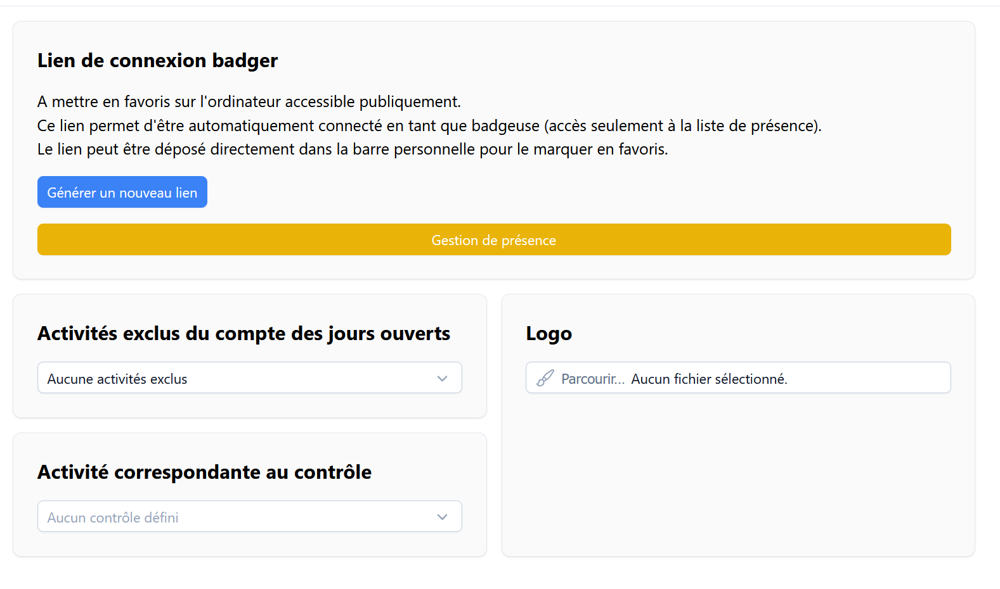

# Démarrage rapide club <RoleLevelComponent level="admin" />

La mise en route une fois le club créé est assez rapide.

Il y a 3 étapes conseillées :

1. [Configuration des activités](#configuration-des-activites)
2. [Configuration globale](#configuration-globale)
3. [Import des membres](#import-des-membres)

## Configuration des activités
> URL : https://narvik.app/admin/config/activities

La gestion des activités étant l'élément centrale, il est fortement conseillé d'en créer au moins 3.

Plus il y aura d'activités d'enregistrées, plus vous pourrez obtenir des statistiques détaillées sur celles-ci.

Celle-ci seront affichées par ordre alphabétique.

Voici une liste d'activités qui sont souvent utilisées :

- `Bureau`
- `Travaux`
- `Permanence`
- `Gestion Administrative`

[Plus d'information](/frontend/docs/activites/administration)

## Configuration globale
> URL : https://narvik.app/admin/config

Sur cette page, vous pourrez définir votre logo afin que celui-ci soit affiché sur le site et aussi dans certains mails et notifications.

Afin d'obtenir des statistiques plus détaillées, il vous est possible d'exclure certaines activités de votre décompte des jours ouverts.

Cela vous permettra d'obtenir le décompte de votre nombre de jours ouvert au public.

[Plus d'information sur la connexion en mode badgeuse](/frontend/docs/membres/presences.html#connexion-en-mode-badgeuse-pointeuse)

## Import des membres
> URL : https://narvik.app/admin/imports/members

Il vous est possible de créer manuellement les membres en cliquant sur le bouton + située sur la page de [listing des membres](https://narvik.app/admin/members).

Il existe aussi une fonctionnalité d'import de masse supportant actuellement un fichier structuré au format CSV.

Si jamais votre fichier est formaté différemment, n'hésitez pas à prendre [contact](https://about.narvik.app/contact) avec nous et nous verrons ensemble ce que nous pourrons faire afin de le supporter dans le futur.
